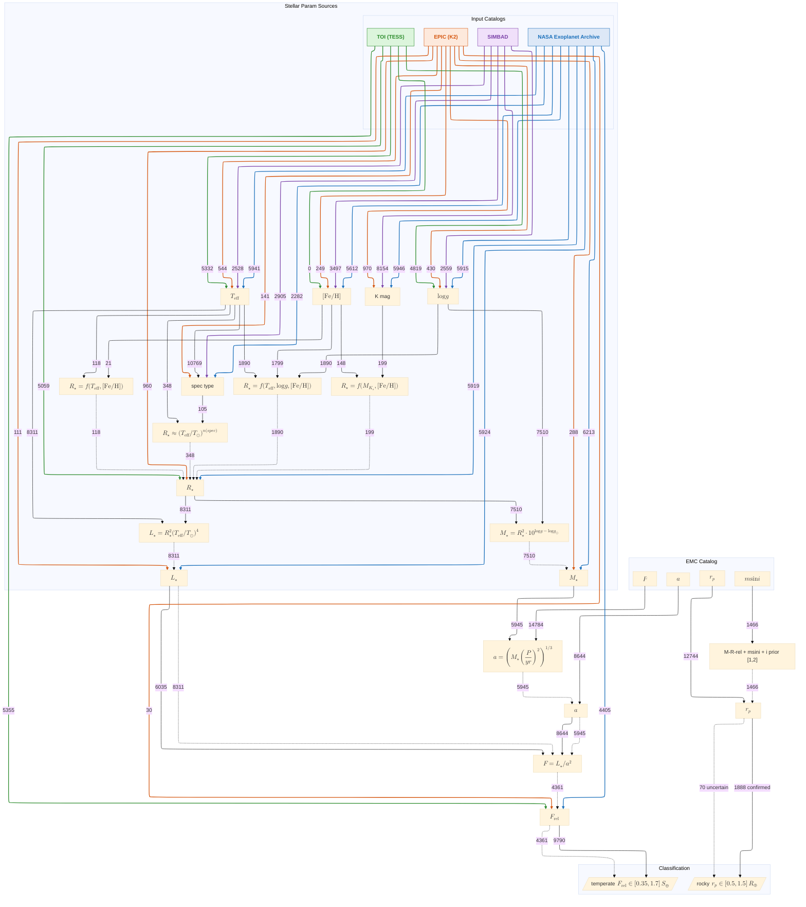

# Architecture

## Package layout

```
crossmatching/
  crossmatcher.py       # Crossmatcher class + allowed_angular_separation()
  config.py             # crossmatching.cfg defaults
  __init__.py           # Public re-exports
  catalogs/
    base.py             # CatalogBase — abstract interface
    nea.py              # NEACatalog — NASA Exoplanet Archive (pscomppars)
    exomercat.py        # EMCCatalog — Exo-MerCat merged catalog
    file.py             # FileCatalog — load from arbitrary local file
  id_suppliers/
    base.py             # IdSupplierBase — abstract interface
    simbad.py           # SimbadIdSupplier — SIMBAD TAP
    emc.py              # EMCIdSupplier — reads aliases from EMC file
  enrichment/
    merger.py           # ParamFiller — priority-ordered parameter merging
    inference.py        # infer_* functions for derived parameters
    masks.py            # rocky_mask(), temperate_mask()
    spectral_types.py   # Spectral-type utilities
    radius_estimation.py# ms_radius_from_teff, mass_radius_chen_kipping
    __init__.py         # Public re-exports
    param_sources/
      base.py           # ParamSource — abstract interface + build helpers
      hpic.py           # HpicParamSource — HPIC crossmatch output
      nea.py            # NeaParamSource — NEA pscomppars
      simbad.py         # SimbadParamSource — SIMBAD mesFe_h tables
      epic.py           # EpicParamSource — K2 EPIC catalog
      toi.py            # ToiParamSource — TESS TOI catalog
      eu.py             # EuParamSource — exoplanet.eu catalog
```


## Enrichment pipeline


**References**
[1] Chen & Kipping 2017, *ApJ* **834**, 17
[2] Stevens & Gaudi 2013, *PASP* **125**, 933
[3] Kopparapu et al. 2013, *ApJ* **765**, 131


The enrichment step adds stellar and derived planetary parameters to a crossmatch result.  Parameters are pulled from up to five sources in priority order the first source that provides a non-null value for a given parameter wins. This is quite crude and leads to likely inconsistent parameters, in the context of this package it was implemented to be able to compare its results to other papers

