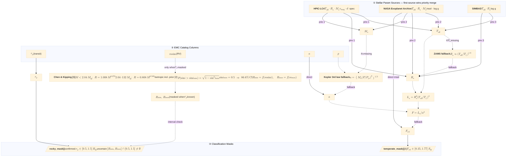

# Enrichment Pipeline

---
**References**  
[1] Chen & Kipping 2017, *ApJ* **834**, 17 — piecewise power-law mass–radius relation  
[2] Stevens & Gaudi 2013, *PASP* **125**, 933 — isotropic orbital inclination prior for RV detections  
[3] Kopparapu et al. 2013, *ApJ* **765**, 131 — conservative habitable-zone flux boundaries
